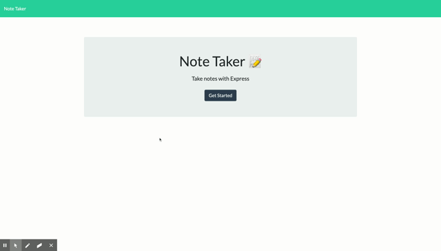
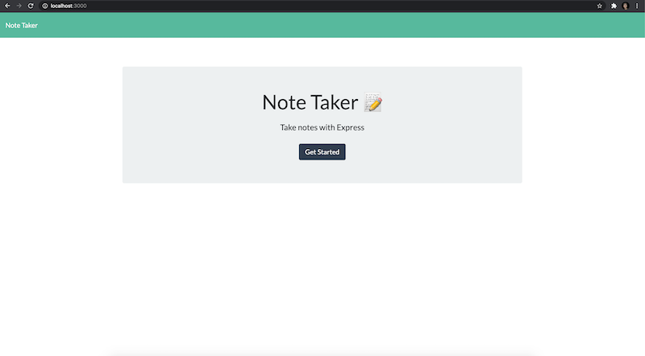
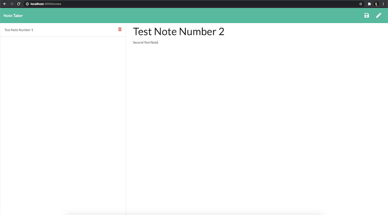

# MyNoteTaker

## Introduction

This application can be used to write, save, and delete notes using an express backend. It will also save and retrieve note data from a JSON file. 

 

## Technologies Used
    * HTML
    * CSS
    * Bootstrap CSS
    * JavaScript
    * NodeJS
    * Express
    * jQuery

## Usage
  This project can be used to keep track of a lot of information, allowing users to have written information available when needed. A video demonstration of the application can be viewed [here](https://youtu.be/9XM8X2csT5E).
  
   
  
## Screenshots

 

## Deployed Link

The deployed portfolio can be found [here](https://ancient-wave-68780.herokuapp.com).

## Contact Information
If you have questions about the application or contributions, I can be contacted via email at:
<maynperalta@gmail.com>
 